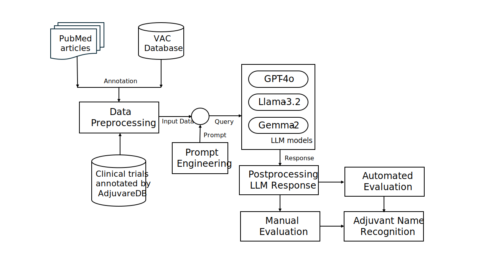
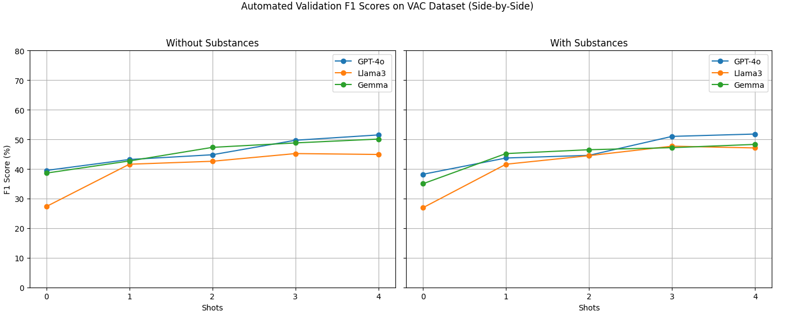
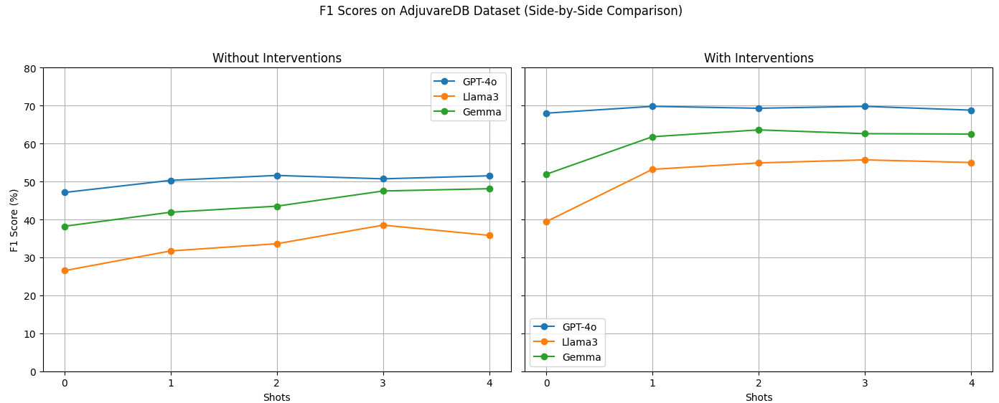

# Vaccine-Adjuvant-LLM

**Vaccine Adjuvant Identification from Biomedical Literature using Large Language Models (LLMs)**

This repository presents a pipeline for identifying vaccine adjuvants in biomedical research articles using LLMs such as GPT-4, Llama3, and Gemma. The approach is evaluated on curated datasets and is designed to support knowledge extraction from scientific literature.

---

## Motivation

Vaccine adjuvants enhance immune responses but are often inconsistently documented in literature. Traditional keyword-based methods miss relevant mentions due to variability in terminology and reporting. This project uses few-shot prompting with LLMs to improve adjuvant name recognition from biomedical abstracts.

---

## Method Overview



---

## 📁 Repository Structure

```
Vaccine-Adjuvant-LLM/
├── Dataset/                    # Input biomedical literature and ground truth
├── Prompts/                    # Prompt templates for few-shot LLM queries
├── Preprocessing_Dataset.ipynb # Data cleaning and filtering
├── Run_GPT.ipynb               # Classification using GPT-4
├── Run_Llama.ipynb             # Classification using Llama3
├── Run_Gemma.ipynb             # Classification using Gemma
├── Postprocess_Output.ipynb    # Format LLM responses
├── Evaluation.ipynb            # Compute F1, precision, recall
├── LICENSE
└── README.md
```

---

## Performance Results

The following figures show F1 score (%) on the **VAC** and **AdjuvareDB** datasets across 0–4 shot prompts.

### VAC Dataset (Side-by-Side Comparison)



### AdjuvareDB Dataset (Side-by-Side Comparison)



> **GPT-4o consistently outperforms** other models, especially in higher-shot settings and when substance/intervention hints are included.

---

##  Setup Instructions

### Dependencies

Install the required packages:

```bash
pip install torch transformers sentence-transformers openai scikit-learn pandas
```

You will also need:

- OpenAI API access (for GPT-4)
- Local or Hugging Face-hosted versions of Llama3 and Gemma models

---

## Example Usage

Run the notebooks in the following order:

1. **Preprocess Data**
   - `Preprocessing_Dataset.ipynb`

2. **Run Inference (choose one)**
   - `Run_GPT.ipynb`
   - `Run_Llama.ipynb`
   - `Run_Gemma.ipynb`

3. **Postprocess Outputs**
   - `Postprocess_Output.ipynb`

4. **Evaluate Performance**
   - `Evaluation.ipynb`

---

## License

This project is licensed under the MIT License. See the [LICENSE](LICENSE) file for details.

---

## Citation

Rehana H, Zheng J, Yeh L, Bansal B, Çam NB, Jemiyo C, McGregor B, Özgür A, He Y, Hur J.  
*Cancer Vaccine Adjuvant Name Recognition from Biomedical Literature using Large Language Models*.  
**ArXiv** [Preprint]. 2025 Feb 12: arXiv:2502.09659v1. PMID: 40196147; PMCID: PMC11975310.
